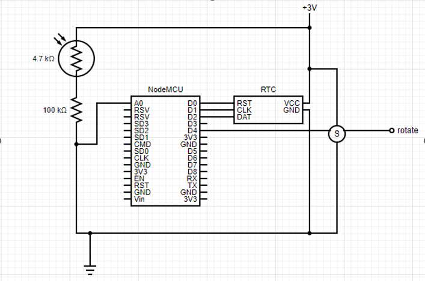

Simple light switch (controlled from a blynk mobile app).

### Circuit design



### Some code explanation

The switch's state in stored in blynk app's V0 virtual port, so, we need to read the state of that port.
```
//blynk connection read params
int appState;
BLYNK_WRITE(V0)
{
  appState = param.asInt();
}
BLYNK_CONNECTED(){
  Blynk.syncVirtual(V0);
}
```

Setting up and initializing the system parameters and components.
```
void setup() {
  Serial.begin(115200); //serial connection for usb data transfer
  Blynk.begin(auth, ssid, pass); // Blynk connection settup
  client.setServer(mqtt_server, mqtt_port); // HiveMQ broker settup
  
  pinMode(servoPin,INPUT); // servo's connected pin (read data)
  servo.attach(servoPin); // bind servo pin for modifying the angle
  servo.write(0); // begin switch off

  Rtc.Begin(); //start the real time clock
  RtcDateTime now = Rtc.GetDateTime();
  setTimeClock(now);
}
```

The following block of code is responsible for handling and controlling the device. It decides whether the user will have control of the device or if the switch will work on auto mode.
```
void loop() {
  Blynk.run();
  
  // Important piece that controls the sensor
  if(!Blynk.connected()){
    //Turn on switch when light is low
    if (lightVal <= 150 && (int) now.Hour() < 17 ) {
        servo.write(130); // open switch
    }else {
        servo.write(0);// close switch
    }
  }else {
    if (appState == 1){
      servo.write(130);
    }else{
      servo.write(0);
    }
  }
```

Luminosity value read from the analog pin, along with the switch's state (either being on or off, this depends on servo's angle; 0 degrees (closed), 130 degrees (open)), is published to the broker. 
with topic of "luminosity/SwitchPj3/dat" and in the form of "luminosity:servo_motor_angle";
-- The angles were decided with my house's switches in mind. Since I could not alter the switch from the inside, I used a servo motor that pushes up or down the already installed switch. --

```
    /*read the light measurement every 10 minutes*/
  if (currentTime-previousTime >= lightReadInterval){
      lightVal = readLightVal(lightInputPin);
      Serial.println(servo.read());
      formatNumber(lightVal, servo.read());
      client.publish("luminocity/SwitchPj3/dat", lightString);
      previousTime = currentTime;
  } 
} // end loop
```
<br><br>

### Specifications 

| Hardware | Details |
| --- | --- |
| 1 x NodeMCU Lua ESP8266 | RISC microcontroller, 4MB flash and integrated Wi-Fi chip |
| 1 x SG90 Micro Servo | Small servo motor with rotation up to 180 degrees |
| 1 x Photoresistor | Small circuit component that detects changes in luminocity |
| 1 x DS1302 RTC | real time clock chip
| 1x 1kΩ resistor | |
|  <br>  | <br>   |
| **Software & other** | **Details** |
| Ubuntu Linux | v20.04.3 (development OS) |
| redis-server | v4.0.7 (installed locally) |
| node-red | v2.1.5 (installed locally) |
| Arduino IDE | v1.8.15 and the following libraries: <br> * ESP8266WiFi <br> * BlynkSimpleEsp8266 <br> * Servo <br> * ThreeWire <br> * RTcDS1302 <br> * PubSubClient |
| Blynk Cloud | Free - limited options |
| HiveMQ & HiveMQ Dashboard | [mqtt-dashboard.com/index.com](mqtt-dashboard.com/index.com) mqtt broker & client-based messaging platform (uses mqtt publish-subscribe protocol) and the dashboard for testing and  monitoring traffic|

<br><br>
I would be extremely grateful for any feedback or tips on how to improve or change these projects. It would help immensely my development as a programmer. 
